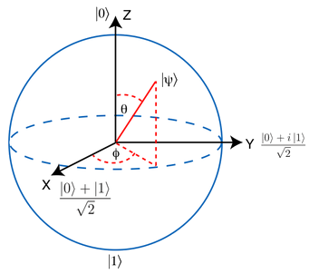

# Faza kwantowa i kąt fazowy qubitu

Jak dobrze pamiętasz, w dziale [Wprowadzenie do Informatyki Kwantowej](../introduction_to_quantum_compiuting/whatIsTheQuantumCompiuting.html) tłumaczyłem [co to jest kubit](../introduction_to_quantum_compiuting/whatIsAQubit.html) i wspomniałem tam, że qubit można sobie wyobrazić jako taką sferę, która ma na swoich biegunach 0 i 1, a pomiędzy tymi liczbami znajdują się jej super pozycje. Powiedzieliśmy już sobie o bramce NOT i bramce Hadamarda, więc umiemy już tworzyć superpozycję. Użycie bramki Hadamarda na qubicie, który jest w stanie podstawowym powodowało, że nagle dostawał on superpozycję, w której miał stan  i  w tym samym czasie. Mając już qubit w superpozycji możemy przesuwać jego stan o tzw. kąt fazowy. Co to jest kąt fazowy zapytasz. Popatrz na grafikę poniżej i analizuj dokładnie sferę Blocha, podczas czytania tego co teraz piszę.

[Źródło grafiki](https://jakubmielczarek.files.wordpress.com/2018/11/bloch.png?w=341&h=303)

Jak widzisz sfera Blocha, tak jak każda inna sfera ma trzy płaszczyzny: Z, Y, X. Do tej pory po użyciu bramki Hadamarda otrzymywaliśmy superpozycję, której kąt fazowy wynosił 0, ponieważ ta super pozycja nie była przesunięta w żadną stronę od biegunu sfery Blocha. Natomiast jeśli na takim qubicie użyjemy np. bramki T ( która przesuwa kąt fazowy superpozycji takiego kubitu o wartość równej PI / 4, gdzie PI jest stałą matematyczną równą około 3,14), to nasza superpozycja przesunęłaby się na osi X, zaznaczonej na zdjęciu linią przerywaną,  o wartość równą PI/4 i najprawdopodobniej wskaźnik tej superpozycji znalazłby się w miejscu, które jest zaznaczone czerwoną strzałką na grafice poniżej. Wartość, o którą teraz jest przesunięty wskaźnik superpozycji na osi X nazywamy kątem fazowym, czyli teraz kąt fazowy tej superpozycji wynosi PI/4.

Skoro już wiesz co to jest kąt fazowy to teraz mogę ci już powiedzieć o bramkach, które przesuwają superpozycję qubitu o jakąś wartość kąta fazowego.
Jedną z takich bramek już znasz, a jest to bramka T, o której wspominałem wcześniej. O to wszystkie bramki zmieniające kąt fazowy qubitu:

| | | |
|:-----------:|:-----------:|:-----------:|
|  | bramka T |  |
|  | bramka S |  |
|  | bramka Z |  |
|  | bramka Sdg |  |
|  | bramka Tdg |  |
|  | bramka  |  |

 - kąt fazowy

 - dowolna wartość
